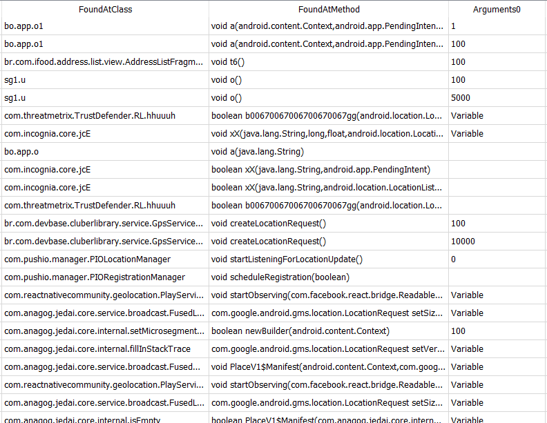
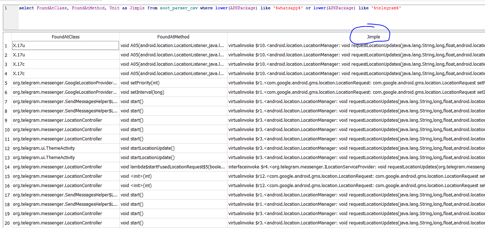
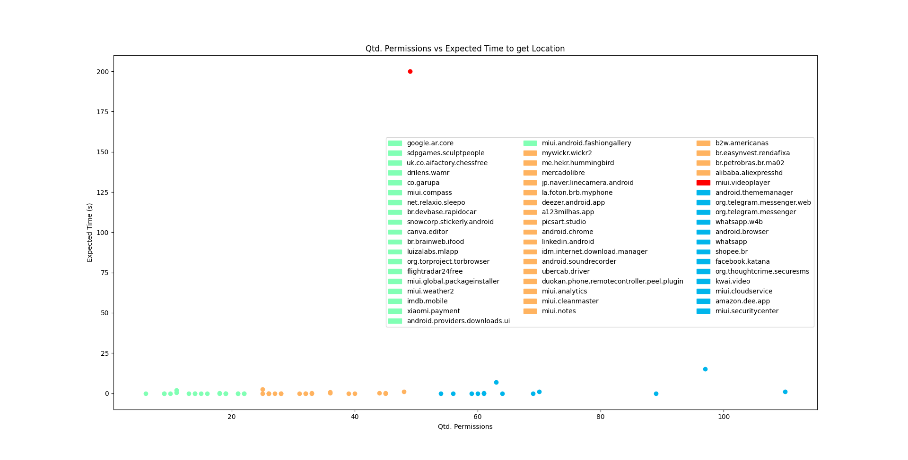
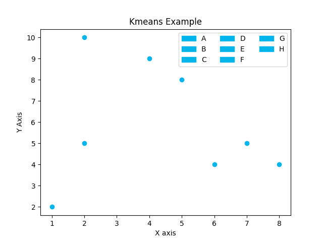
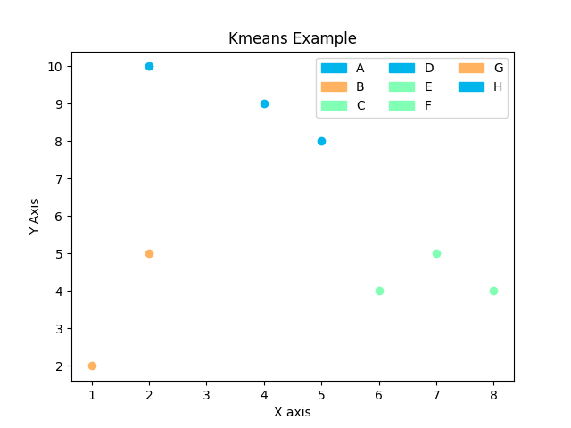

# Static Analysis with Soot 
Static Analysis with Soot - And a Scatter Plot created with kmeans clustering method

## Thanks
Noidsirius SOOT TUTORIAL was very helpfull. The [noidsirius](https://github.com/noidsirius/) made the tutorial available at [here](https://github.com/noidsirius/SootTutorial)

Thanks to [rbonifacio](https://github.com/rbonifacio/pca) too for the introduction to Static Analysis and for the talks about soot.

## Introduction
The following **140 Android Apps** were submited to static analysis with the intention to find references to services that could receive the devices LOCATION information such as lattitude and longitude. While processing each app, the list of permitions that it needs were also collected. The collected information was then used to build a SQLite database which was the imput to the kmeans clustering.

We noticed that **76 Android Apps** had at least one permission related to LOCATION services.

Not all of them could be analysed with soot framework, since there were many out of memory erros which should be investigated further.

The final list had **57 apps**, each with a reference to the Android instruction that referenced LOCATION api. 

The following topics show the results that we found. _Notice that, no matter how complex the Android App is, most of them expects that the users LOCATION information is provided as soon as possible_. The next topics shows some of the information that was extracted which was obtained with the help of the soot framework.

| Package Name                      | Package Name                      | Package Name                      | Package Name                         | Package Name                       | Package Name                            | Package Name                        | Package Name                                  |
|-----------------------------------|-----------------------------------|-----------------------------------|--------------------------------------|------------------------------------|-----------------------------------------|-------------------------------------|-----------------------------------------------|
| abdelrahman.wifianalyzerpro       | com.facebook.system               | com.mcdo.mcdonalds                | com.spotify.music                    | com.android.providers.downloads.ui | com.google.android.googlequicksearchbox | com.miui.mishare.connectivity       | idm.internet.download.manager                 |
| br.com.brainweb.ifood             | com.facemoji.lite                 | com.mercadolibre                  | com.topjohnwu.magisk                 | com.android.soundrecorder          | com.google.android.ims                  | com.miui.msa.global                 | jp.naver.linecamera.android                   |
| br.com.devbase.rapidocar          | com.facemoji.lite.xiaomi          | com.mi.android.globalFileexplorer | com.ubercab                          | com.android.thememanager           | com.google.android.inputmethod.latin    | com.miui.notes                      | la.foton.brb.myphone                          |
| br.com.easynvest.rendafixa        | com.flightradar24free             | com.mi.android.globalminusscreen  | com.ubercab.driver                   | com.android.vending                | com.google.android.marvin.talkback      | com.miui.player                     | lssystem.com.grotg.hpp.lssmoneyscanner        |
| br.com.petrobras.br.ma02          | com.globo.g1.app                  | com.micredit.in                   | com.waze                             | com.anydesk.adcontrol.ad1          | com.google.android.music                | com.miui.screenrecorder             | me.hekr.hummingbird                           |
| br.gov.df.pcdf.EIdentidade        | com.globo.globotv                 | com.milink.service                | com.whatsapp                         | com.anydesk.anydeskandroid         | com.google.android.tts                  | com.miui.securitycenter             | net.relaxio.sleepo                            |
| br.gov.serpro.lince               | com.google.android.apps.docs      | com.miui.analytics                | com.whatsapp.w4b                     | com.appnewsdelivery.app            | com.google.android.videos               | com.miui.videoplayer                | org.ab.x48                                    |
| co.garupa                         | com.google.android.apps.maps      | com.miui.android.fashiongallery   | com.whatsapp_call_ip                 | com.aviationwb                     | com.google.android.youtube              | com.miui.weather2                   | org.pcdf.emailspitools                        |
| com.a123milhas.app                | com.google.android.apps.messaging | com.miui.calculator               | com.xiaomi.account                   | com.b2w.americanas                 | com.google.ar.core                      | com.miui.wmsvc                      | org.telegram.messenger                        |
| com.alibaba.aliexpresshd          | com.google.android.apps.photos    | com.miui.cleanmaster              | com.xiaomi.discover                  | com.b2winc.amedigital              | com.google.ar.lens                      | com.mywickr.wickr2                  | org.telegram.messenger.web                    |
| com.amazon.dee.app                | com.google.android.apps.tachyon   | com.miui.cloudbackup              | com.xiaomi.glgm                      | com.boticario.mobile               | com.hmdm.control                        | com.picsart.studio                  | org.thoughtcrime.securesms                    |
| com.amazon.mp3                    | com.google.android.apps.turbo     | com.miui.cloudservice             | com.xiaomi.midrop                    | com.canva.editor                   | com.imdb.mobile                         | com.pinterest                       | org.torproject.torbrowser                     |
| com.amazon.mShop.android.shopping | com.google.android.apps.wellbeing | com.miui.compass                  | com.xiaomi.payment                   | com.drilens.wamr                   | com.instagram.android                   | com.reddit.frontpage                | com.duokan.phone.remotecontroller.peel.plugin |
| com.android.browser               | com.google.android.contacts       | com.miui.fm                       | com.zhiliaoapp.musically             | com.ehub.phonefactoryreset         | com.kwai.video                          | com.schibsted.bomnegocio.androidApp | teludev.project.whatswebscan                  |
| com.android.calendar              | com.google.android.dialer         | com.miui.global.packageinstaller  | com.zoiper.android.app               | com.facebook.appmanager            | com.lakehorn.android.aeroweather        | com.sdpgames.sculptpeople           | uk.co.aifactory.chessfree                     |
| com.android.chrome                | com.google.android.gm             | com.miui.hybrid                   | deezer.android.app                   | com.facebook.katana                | com.lemon.lvoverseas                    | com.shopee.br                       | cn.wps.xiaomi.abroad.lite                     |
| com.android.deskclock             | com.google.android.gms            | com.miui.miservice                | homeworkout.homeworkouts.noequipment | com.facebook.orca                  | com.linkedin.android                    | com.snapchat.android                | com.duokan.phone.remotecontroller             |
| com.facebook.services             | com.luizalabs.mlapp               | com.snowcorp.stickerly.android    |                                      |                                    |                                         |                                     |                                               |

## SOOT
Soot framework is very powerfull. It was configured to search for references to ```android.location.LocationManager```, ```requestLocationUpdates```, ```gms.location.LocationRequest```, ```requestSingleUpdate``` and ```getLastKnownLocation```. As a result we could sometimes relate this method with some constant argument. Other times, we found that the argument was passed on in Variables (arguments that were not constants). The following picture shows some of the extracted data, with the argument that we could capture. The full database is available at [here](example-analysis/example-analysis.db).



The following code shows the references to the LOCATION api were captured with the help of the cless UsageSearchSpec, created with this pourpouse. And the next picture shows some jimple extracted from the invocation point.

```java
public static UsageSearchSpec createSpec() {
		String methodSignature = "void requestLocationUpdates(java.lang.String,long,float,android.app.PendingIntent)";
		String classSignature = "android.location.LocationManager";
		return new UsageSearchSpec(methodSignature, classSignature, 1, 2);
}
```



### Results
The next image shows a Scatter Grapth with Y Axis having an estimate of how often the app expects LOCATION information and with on the X Axis the number of all permissions that the app requests in it's manifest. You can see that most of the apps, when it calls LOCATION API, it seems that it expects to have users location as soon as possible. We think that not all users are aware of this and it seems that it might be the case that, most of the time, there might be some app requesting information about the user's location. By the way, this is just a feeling, since we didn't go deeper studing when the invocation point was called. We focused mainly on the parameters.




### K-means and Machine Learning
We implemented k-means clustering algorithm by ourselves. The following picture shows data with and without clustering that is made available by using the same colors for the same clusters.





